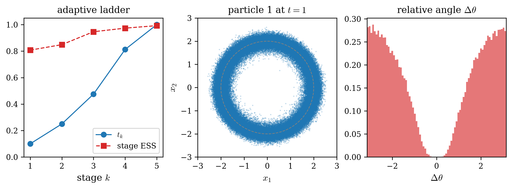

# Example results

Numerical results of the runnable examples in this folder.

## 2D_single — reverse KL vs forward KL

Single-stage flow training on a 2D three-mode target, comparing the reverse KL and forward KL objectives under the 100% energy-driven workflow of [`2D_single.py`](2D_single.py).

### Setup

- **Source** $\mu_0 \propto e^{-U_0}$: isotropic Gaussian, $U_0(x) = \lVert x\rVert^2 / (2\sigma^2)$, $\sigma = 2$.
- **Target** $\mu_1 \propto e^{-U_1}$: three-mode Gaussian mixture placed like the Julia three-dot sign — equal weights, means $(0, 2.4)$, $(-2.2, -1.4)$, $(2.2, -1.4)$, per-coordinate variance $0.3$. The modes are separated by $\sim 8$ standard deviations, so a mode-seeking objective can lose mass while a mass-covering one should not.
- **Flow**: NSF on $[-5, 5]^2$, 16 bins, 4 autoregressive transforms, $(64, 64)$ conditioners, identity-initialised (`zeros()`).
- **Training**: one packed call per method — `N_VALID = 40000` fixed source set, `N_BATCH = 2000` per Adam step, `STEPS = 200`, `LR = 1e-3`, Langevin rejuvenation `MC_STEP = 1e-3`, `MC_ITERS = 100`, single-rung AIS (`LADDER = 1`).

Both trainers regenerate their batch inside every Adam step. The reverse KL flow acts as $F$ (source → target, `type='F'`): each step draws an `N_BATCH` subset of the fixed set and freshens it with Langevin steps at the source. The forward KL flow acts as $G$ (target → source, `type='G'`): each step manufactures its target batch by single-rung AIS through the *current* flow — pushforward, self-normalized reweighting, multinomial resampling, Langevin rejuvenation at the target. Neither objective touches the inverse map during training, and the final ESS is computed on the full fixed set through the flow importance weights.

### Results

| objective | final ESS ($N = 40000$) | batch ESS along training |
| --------- | :---: | :---: |
| reverse KL | 0.9324 | 0.19 → 0.83 → 0.93 |
| forward KL | 0.9500 | 0.74 → 0.97 → 0.96 |

The left panel shows the per-step batch-ESS histories returned by the trainers (x-axis exactly $[0, 200]$); the middle and right panels show the `N_VALID` pushforward samples of each method (blue: $y = F(x)$; red: $y = G^{-1}(x)$) over the target energy background, with 5000 source samples in gray for context.

### Reading the result

Both flows populate all three modes, and the AIS-fed forward KL ends with the higher ESS: its data pipeline supplies (approximately) target-distributed samples covering every mode from the first step — its batch ESS starts already at $\sim 0.75$ — while the reverse KL starts near $0.18$ and pays its mode-seeking tax as the barriers grow. On a harder target — farther modes, or modes the initial proposal never reaches — the reverse objective can collapse entirely, and the forward objective inherits whatever the AIS chain covers; that regime (and the regularization that addresses it) is the subject of the X-regularization line of work these conventions come from.

Two practical notes. First, wall clock: each packed 200-step training compiles in a few seconds and executes in 1.5–2.5 s on an RTX 5070 Ti; the whole script (both trainings, evaluation, figure) runs in about 12 s. Second, reproducibility: the trainers are deterministic within a process (fixed internal seed — two identical calls agree bit for bit), while across separate launches XLA kernel autotuning can introduce last-ulp differences that 200 training steps amplify, so the final ESS varies by a few times $10^{-2}$ between runs (reverse KL $\approx 0.92$–$0.93$, forward KL $\approx 0.95$).

## 4D_Boltzmann_generator — annealed BG with the adaptive ladder

The 4D two-charge target of zflows' `tests/4D_Boltzmann_generator.py`, sampled by [`4D_Boltzmann_generator.py`](4D_Boltzmann_generator.py) with `boltzmann_reverse_KL`: reverse KL along the bridge ladder $U_t = (1-t)\,U_0 + t\,U_1$, with the coefficient $t$ selected adaptively instead of the original fixed schedule $c_k = k/12$.

### Setup

- **Source** $\mu_0$: standard Gaussian on $\mathbb R^4$.
- **Target**: two particles $x = (x_1, x_2)$, $x_i \in \mathbb R^2$, on a soft annulus with regularized 3D Coulomb repulsion,
  $U_1(x) = a\,[(\lVert x_1\rVert^2 - r_0^2)^2 + (\lVert x_2\rVert^2 - r_0^2)^2] + q^2 / \sqrt{\lVert x_1 - x_2\rVert^2 + \varepsilon^2}$
  with $r_0 = 2$, $a = 1$, $q^2 = 4$, $\varepsilon = 10^{-3}$ (identical to the original).
- **Flow**: NSF on $[-3, 3]^4$, 8 bins, 4 autoregressive transforms, $(64, 64)$ conditioners, identity-initialised.
- **Boltzmann generator**: the stage flows are connected step by step — stage $k$ trains the warm-started flow as the incremental map $\mu_{t_{k-1}} \to \mu_{t_k}$ on batches drawn from the advancing particle set, accepts on the incremental importance-sampling ESS, and advances the set by reweight → resample → Langevin at $U_{t_k}$. Parameters: `N_VALID = 120000`, `N_BATCH = 2000`, `STEPS = 500`, `LR = 1e-4`, Langevin `1e-3 × 100`; ladder `t_safe = 0.1`, `shrink_factor = 0.7`, `enlarge_factor = 1.5`, `tau = 0.6`.

### Results

The adaptive ladder reaches $t = 1$ in five stages, every stage accepted on its first attempt, in 7.7 s end to end on the full 120000-particle set (the stage trainer, weight evaluation, and advance each compile once and are reused across all stages):

| stage $k$ | 1 | 2 | 3 | 4 | 5 |
| --------- | :---: | :---: | :---: | :---: | :---: |
| $t_k$     | 0.10 | 0.25 | 0.475 | 0.8125 | 1.0 |
| ESS       | 0.808 | 0.849 | 0.946 | 0.974 | 0.992 |

The left panel shows the adaptive ladder ($t_k$ and the per-stage incremental ESS); the middle panel the particle-1 marginal at $t = 1$, concentrated on the annulus $\lVert x_1 \rVert = r_0$ (dashed circle); the right panel the relative angle $\Delta\theta$ between the two particles, peaked at $\pm\pi$ with vanishing density at $0$ — the antipodal Coulomb minimum.

### Reading the result

The ESS trace follows the reference behaviour of the original fixed-ladder run — a lower leading rung, then a high plateau — while the ESS-gated selection compresses the schedule: the leading increment is small (`t_safe`), the accepted step then grows by the enlarge factor, and the final extrapolation snaps to $t = 1$, so five stages cover what the fixed schedule spent twelve rungs on. The generator's sample output is the advanced particle set; the per-stage incremental flows and their acceptance ESS are returned in the stage records.
