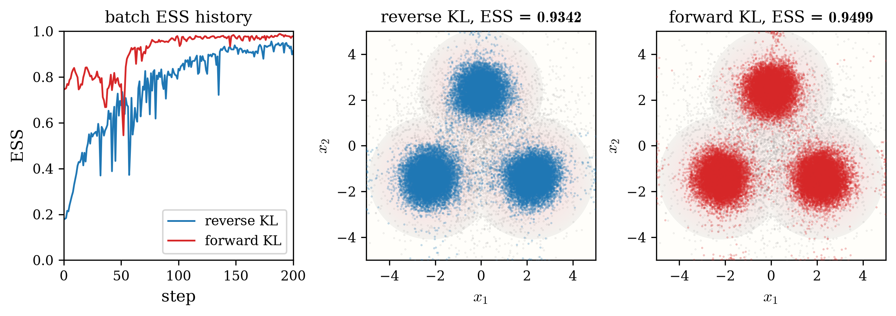
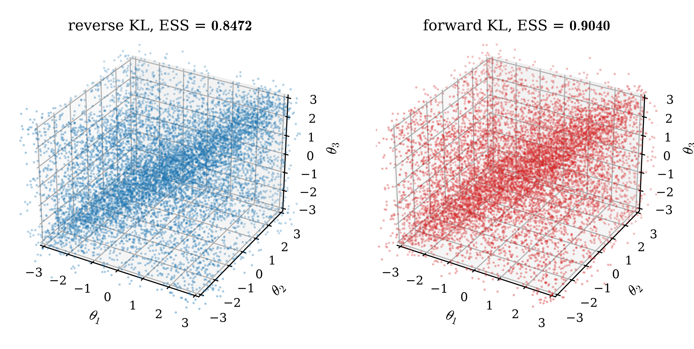

# Example results

Numerical results of the runnable examples in this folder.

## 2D_single — reverse KL vs forward KL

Single-stage flow training on a 2D three-mode target, comparing the reverse KL and forward KL objectives under the 100% energy-driven workflow of [`2D_single.py`](2D_single.py).

### Setup

- **Source** $\pi_0 \propto e^{-U_0}$: isotropic Gaussian, $U_0(x) = \lVert x\rVert^2 / (2\sigma^2)$, $\sigma = 2$.
- **Target** $\pi \propto e^{-U_1}$: three-mode Gaussian mixture placed like the Julia three-dot sign — equal weights, means $(0, 2.4)$, $(-2.2, -1.4)$, $(2.2, -1.4)$, per-coordinate variance $0.3$. The modes are separated by $\sim 8$ standard deviations, so a mode-seeking objective can lose mass while a mass-covering one should not.
- **Flow**: NSF on $[-5, 5]^2$, 16 bins, 4 autoregressive transforms, $(64, 64)$ conditioners, identity-initialised (`zeros()`).
- **Training**: one packed call per method — `VALID_SIZE = 40000` fixed source set, `BATCH_SIZE = 2000` per Adam step, `STEPS_TOTAL = 200`, `LR = 1e-3`, Langevin rejuvenation `MC_DT = 1e-3`, `MC_STEPS_1 = 100`, single-level SMC (`LADDER = 1`).

Both trainers regenerate their batch inside every Adam step. The reverse KL flow acts as $F$ (source → target, `train_reverse_KL_F`): each step draws a `BATCH_SIZE` subset of the fixed set and freshens it with Langevin steps at the source. The forward KL flow acts as $G$ (target → source, `train_forward_KL_G`): each step manufactures its target batch by single-level SMC through the *current* flow — inverse pushforward, self-normalized reweighting, multinomial resampling, and Langevin rejuvenation at the target. The loss is differentiated only in its native $G$ direction; the detached SMC data-generation path performs the inverse push. The final ESS is computed on the full fixed source set through the flow importance weights.

### Results

| objective  | final ESS ($N = 40000$) | batch ESS along training |
| :--------: | :---------------------: | :----------------------: |
| reverse KL |         0.9081          |   0.19 -> 0.82 -> 0.92   |
| forward KL |         0.9427          |   0.19 -> 0.93 -> 0.94   |

The left panel shows the per-step proposal-to-target batch-ESS histories returned by the trainers (x-axis exactly $[0, 200]$). For forward KL this is measured on the current proposal immediately before the SMC correction, matching the final importance-weight convention. The middle and right panels show the `VALID_SIZE` pushforward samples of each method (blue: $y = F(x)$; red: $y = G^{-1}(x)$) over the target energy background, with 5000 source samples in gray for context.

### Reading the result

Both identity-initialized proposals begin with low overlap, near $0.19$. The SMC-fed forward loss then raises proposal ESS more rapidly and finishes higher, while both flows populate all three modes. On a harder target — farther modes, or modes the initial proposal never reaches — the reverse objective can collapse entirely, and the forward objective inherits whatever the SMC chain covers; that regime (and the regularization that addresses it) is the subject of the X-regularization line of work these conventions come from.

Two practical notes. First, each packed 200-step training compiles in a few seconds, and the complete script remains a seconds-scale example on a modern CUDA GPU. Second, the trainers are deterministic within a process (fixed internal seed — two identical calls agree bit for bit), while across separate launches XLA kernel autotuning can introduce last-ulp differences that 200 training steps amplify. The representative values above are therefore a current verified run, not bit-level cross-launch targets.

## 3D_periodic — the NCSF on the torus

Run by [`3D_periodic.py`](3D_periodic.py): its purpose is to show that the **NCSF actually works** — the circular-spline flow trains, inverts, and reweights correctly on a genuinely periodic domain.

### Setup

- **Source** $\pi_0$: uniform on the periodic box $[-\pi, \pi]^3$.
- **Target** $\pi \propto e^{-U_1}$: the von Mises ridge mixture on the 3-torus,
  $U_1(x) = -\log[\, e^{\kappa\cos(x_1 - x_2)} + e^{\kappa\cos(x_2 - x_3)} + e^{\kappa\cos(x_3 - x_1)} \,]$, $\kappa = 4$ — three pairwise ridges that wrap around the torus.
- **Flow**: NCSF on $[-\pi, \pi]^3$, 8 bins, 4 autoregressive transforms, $(128, 128)$ conditioners, identity-initialised.
- **Training**: one packed call per objective — `VALID_SIZE = 40000` fixed source set, `BATCH_SIZE = 2000` per Adam step, `STEPS_TOTAL = 200`, `LR = 1e-3` — followed by the reweighting pipeline: importance weights → ESS → multinomial resampling → MALA rejuvenation at the target (`MC_DT = 1e-3`, `MC_STEPS_2 = 100`).

### Results

| objective  | final ESS ($N = 40000$) |
| :--------: | :---------------------: |
| reverse KL |         0.8973          |
| forward KL |         0.9003          |

Both panels show the resampled and rejuvenated particle sets (left: reverse KL; right: forward KL) concentrating on the wrap-around ridge tubes of the target — the structure a non-periodic flow cannot represent without seam artifacts. The healthy ESS of both objectives on this domain is the point: the NCSF's circular splines carry the periodic geometry end to end.

## 4D_boltzmann — adaptive-staging BG

The 4D two-charge target, sampled by [`4D_boltzmann.py`](4D_boltzmann.py) with both adaptive-staging generators — `boltzmann_reverse_KL_F` and `boltzmann_forward_KL_G` — along the stage schedule $U_t = (1-t)\,U_0 + t\,U_1$, with the coefficient $t$ selected adaptively instead of a fixed schedule $c_k = k/12$.

### Setup

- **Source** $\pi_0$: standard Gaussian on $\mathbb R^4$.
- **Target**: two particles $x = (x_1, x_2)$, $x_i \in \mathbb R^2$, on a soft annulus with regularized 3D Coulomb repulsion,
  $U_1(x) = a\,[(\lVert x_1\rVert^2 - r_0^2)^2 + (\lVert x_2\rVert^2 - r_0^2)^2] + q^2 / \sqrt{\lVert x_1 - x_2\rVert^2 + \varepsilon^2}$
  with $r_0 = 2$, $a = 1$, $q^2 = 4$, $\varepsilon = 10^{-3}$ (identical to the original).
- **Flow**: NSF on $[-3, 3]^4$, 8 bins, 6 autoregressive transforms, $(64, 64)$ conditioners, identity-initialised.
- **Boltzmann generators**: the stage flows are connected step by step — stage $k$ proposes $t_k$ by the safe start or the enlarge-factor extrapolation, trains an identity-initialized incremental map $\mu_{t_{k-1}} \to \mu_{t_k}$ on the advancing particle set, accepts on the validation ESS of the better of the trained map and the identity (`tau_valid`), shrinks $t_k$ otherwise, and advances the set by reweight → resample → MALA at $U_{t_k}$ (`mc_adjust = True`; the Metropolis gate keeps the near-singular Coulomb tail out of the particle set). The reverse KL stages train on Langevin-freshened batches of the set; the forward KL stages train on target batches manufactured per Adam step by SMC through the current flow (`LADDER` levels). Parameters: `VALID_SIZE = 120000`, `BATCH_SIZE = 2000`, `STEPS_TOTAL = 500`, `LR = 1e-4`, MALA `MC_DT = 1e-3`, `MC_STEPS_1 = MC_STEPS_2 = 100`; stage-schedule controls `t_safe = 0.2`, `shrink_factor = 0.7`, `enlarge_factor = 1.5`, `tau_valid = 0.6`.

### Results

The verified rerun completed both adaptive stage schedules. Reverse KL accepted five
stages, $t=[0.098, 0.245, 0.4655, 0.7963, 1.0]$, with incremental ESS
$[0.780, 0.931, 0.947, 0.969, 0.991]$. Forward KL accepted four stages,
$t=[0.2, 0.5, 0.95, 1.0]$, with ESS
$[0.763, 0.902, 0.960, 0.997]$. The first reverse stage reached $t=0.098$
after the rejected candidates $0.2$ and $0.14$ under `shrink_factor = 0.7`,
each rejected by the validation ESS gate `tau_valid`; the table reports
accepted stages only. Exact ESS values
can move slightly with accelerator kernels, and the script refuses to produce
a target-labelled figure if either stage schedule is incomplete.

The accepted ESS is per stage the better of the trained flow and the identity
map (pure importance reweighting): after training, each stage keeps whichever
has the higher validation ESS, so a stage is never worse than the identity.

Each row (top: reverse KL; bottom: forward KL) shows the adaptive stage schedule ($t_k$ and the per-stage incremental ESS), the particle-1 marginal at $t = 1$ concentrated on the annulus $\lVert x_1 \rVert = r_0$ (dashed circle), and the relative angle $\Delta\theta$ between the two particles, peaked at $\pm\pi$ with vanishing density at $0$ — the antipodal Coulomb minimum.

### Reading the result

The ESS trace follows the reference behaviour of the original fixed-schedule run — a lower leading stage, then a high plateau — while the ESS-gated selection compresses the schedule: the leading increment is small (`t_safe`), the accepted step then grows by the enlarge factor, and the final extrapolation snaps to $t = 1$, so four or five stages cover what the fixed schedule spent twelve stages on. The generator's sample output is the advanced particle set; the per-stage incremental flows and their acceptance ESS are returned in the stage records.

## CNF_vs_OTFlow — continuous flows across dimension

CNF versus OTFlow on a fixed multi-modal target as the dimension grows, run by [`CNF_vs_OTFlow.py`](CNF_vs_OTFlow.py). Both continuous flows are trained by the **same** objective, plain reverse KL, so the comparison isolates the one variable that differs: the velocity-field architecture.

### Setup

- **Source** $\pi_0$: standard Gaussian on $\mathbb R^d$.
- **Target** $\pi \propto e^{-U_1}$: a factorized multi-well potential whose mode count stays fixed while $d$ is swept,
  $U_1(x) = \sum_{i < 3} \beta_{\mathrm w}\,((x_i / s)^2 - 1)^2 + \sum_{i \ge 3} \tfrac12 x_i^2$, with $s = 1.5$, $\beta_{\mathrm w} = 1.5$. The first three coordinates are symmetric double wells (minima at $\pm s$), giving $2^3 = 8$ modes; the remaining $d - 3$ coordinates are standard Gaussian and only raise the dimension. The barrier is deliberately shallow so mode-seeking reverse KL must cover all eight modes rather than collapse onto a subset.
- **Flows**: `CNF` (FFJORD, free-form MLP velocity, exact $O(d)$ augmented-Jacobian trace) with `frequency = 4`; `OTFlow` (velocity $= -\nabla\Phi$ with a closed-form Hessian trace) with `hidden = 64`, `layer = 3`, `rank = min(10, d+1)`. Both integrate with the same fixed-step RK4 (`nt = 12`) and width-64 networks. CNF starts at the exact identity; OTFlow uses `near_identity()`, whose $10^{-6}$ PSD-factor seed is a numerical identity in float32 while keeping its full quadratic head trainable.
- **Training**: one packed `train_reverse_KL_F` call per cell — plain reverse KL with no rejuvenation (`MC_STEPS_1 = 0`), `VALID_SIZE = 40000` fixed source pool, `BATCH_SIZE = 512` per Adam step, `STEPS_TOTAL = 1000`, `LR = 2e-3`, `checkpoint = True` (the CNF exact-trace path). The final ESS is the proposal importance-sampling ESS on a held-out $N = 20000$ source set.

### Results

| flow   | $d=4$  | $d=8$  | $d=16$ | $d=32$ | $d=64$ | $d=128$ |
| :----: | :----: | :----: | :----: | :----: | :----: | :-----: |
| CNF    | 0.9705 | 0.9579 | 0.9311 | 0.8824 | 0.7411 | 0.4291  |
| OTFlow | 0.9694 | 0.9637 | 0.9458 | 0.9145 | 0.8478 | 0.5927  |

The tidy numbers are also written to [`CNF_vs_OTFlow.csv`](CNF_vs_OTFlow.csv) (`flow, dimension, ess, train_seconds`) for downstream plotting.

### Reading the result

Pushed out to $d = 128$, the two flows start essentially tied at low dimension ($\approx 0.97$ at $d = 4$) and then separate: from $d = 8$ onward OTFlow stays above the CNF, and while both lose ESS as the dimension climbs, the CNF falls faster — from $0.97$ down to $0.43$ at $d = 128$, versus OTFlow's $0.97 \to 0.59$. The advantage grows with dimension (already $0.74$ vs $0.85$ at $d = 64$), so OTFlow's closed-form-trace / potential-gradient parameterisation is markedly more dimension-robust than the CNF's free-form velocity — the mode-seeking CNF's importance weights spike sooner as the ambient dimension grows. The high-dimensional cells converge slowly and use the full $1000$-step budget; per-cell wall time is tens of seconds and grows with $d$, the CNF's $O(d)$ exact trace closing most of the cost gap to OTFlow by $d = 128$. As with the other examples these are single-seed numbers that shift by a few times $10^{-2}$ between launches, so the reproducible finding is the widening high-dimensional OTFlow-over-CNF ordering, not the third decimal.

## flow_scaling_law — forward vs inverse map latency

Forward versus inverse map latency of an NSF as the dimension grows, run by [`flow_scaling_law.py`](flow_scaling_law.py). jflows has no `torch.compile`, so this measures the pure jitted cost of the two fused maps, each returned with its $\log|\det J|$.

### Setup

- **Flow**: NSF on $[-3, 3]^d$, 12 bins, 4 autoregressive transforms, random-initialised (a nontrivial bijection, so the inverse does real work), with the conditioner width swept over $(64, 64)$, $(128, 128)$, $(256, 256)$.
- **Maps**: `forward_map` $=$ `flow.call_and_ladj(x)` and `inverse_map` $=$ `flow.inv_and_ladj(y)`, each `eqx.filter_jit`-compiled once per (width, $d$) cell.
- **Timing**: fixed `BATCH = 2000`, `WARMUP = 20` untimed calls to absorb the XLA compile, `TIMED = 50` timed calls, a single `block_until_ready` after the batch; latency is the mean wall time per call. Dimension swept over $d \in \{4, 8, 16, 32, 64, 128\}$.

### Results

Forward map, mean ms per call:

| width   |  $d=4$ |  $d=8$ | $d=16$ | $d=32$ | $d=64$ | $d=128$ |
| :-----: | :----: | :----: | :----: | :----: | :----: | :-----: |
| 64x64   | 0.179  | 0.173  | 0.187  | 0.213  | 0.261  |  0.407  |
| 128x128 | 0.158  | 0.167  | 0.200  | 0.218  | 0.341  |  0.462  |
| 256x256 | 0.185  | 0.212  | 0.226  | 0.271  | 0.359  |  0.591  |

Inverse map, mean ms per call:

| width   | $d=4$ | $d=8$ | $d=16$ | $d=32$ | $d=64$ | $d=128$ |
| :-----: | :---: | :---: | :----: | :----: | :----: | :-----: |
| 64x64   | 0.436 | 0.747 | 1.594  | 3.936  | 12.037 | 41.539  |
| 128x128 | 0.502 | 0.902 | 1.723  | 4.542  | 13.795 | 47.833  |
| 256x256 | 0.645 | 1.175 | 2.370  | 6.055  | 19.111 | 63.700  |

The full grid, with the inv/fwd ratio, is written to [`flow_scaling_law.csv`](flow_scaling_law.csv) (`hidden_features, dimension, forward_ms, inverse_ms, inv_over_fwd`).

### Reading the result

The forward map is a single parallel pass and stays essentially flat in dimension — at $(64, 64)$ it moves only $0.179 \to 0.407$ ms from $d = 4$ to $d = 128$ over a $32\times$ dimension increase. The inverse is autoregressive: a MAF-style flow inverts one coordinate at a time, so it runs $d$ sequential conditioner passes and climbs steeply — $0.436 \to 41.5$ ms at $(64, 64)$, roughly $95\times$, and steepening as $d$ rises. The resulting inv/fwd penalty opens from $\sim 2.4\times$ at $d = 4$ to $102$--$108\times$ at $d = 128$. Widening the conditioner ($64 \to 256$) raises both maps but far less than dimension does — at $d = 128$ the inverse grows from $41.5$ to $63.7$ ms and the forward from $0.41$ to $0.59$ ms — so dimension, through the sequential autoregressive inversion, is the dominant cost, not MLP width. This is the intrinsic forward/inverse asymmetry of autoregressive spline flows, and it is why loss differentiation stays in each flow's native direction even when detached data-generation or final evaluation must use the inverse. The absolute milliseconds are GPU-specific; the scaling — a near-flat forward and a steeply growing inverse, dominated by dimension — is the reproducible finding.
